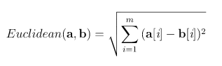

# similarity-theory

This repository consists of Ruby scripts and functions for similarity theory. I'm not making a claim of mathematical identity, but it might be a useful set of helper functions for your own machine learning project, especially if you working with students and plan to look under the hood of similarity models. 

In the following, I am giving an overview of Ruby scripts and functions for classification tasks in similarity theory. Every module covers one part which is used in our machine learning classes.

## knn.rb

The *k*-NN module covers the *k*-Nearest Neighbours model with several similarity metrics.

### knn(DataFrame, int, Array, (opt)String)
The `knn` function takes a [Daru](https://github.com/SciRuby/daru)::DataFrame object which has the following structure:

| Cont. Feature 1 | Cont. Feature 2 | ... | Cont. Feature n | Target Feature          |
| ----------------|-----------------|-----|-----------------|------------------------ |
| random value    | random value    | ... | random value    | random value/category   |
| ...             | ...             | ... | ...             | ...                     |

The next parameter is the amount of neighbours you want to take into account, so that's our `k`. Then we have the `query` Array that needs to have the same amount of continuous features as our dataset, but no target. The last parameter is optional. It selects the similarity metric to be used.

The `return` value of this function will be a prediction for the `query`. 

### euclidean(a, b)
This function uses instances `a` and `b` and returns the *euclidean* distance between them. As in the following equation:

